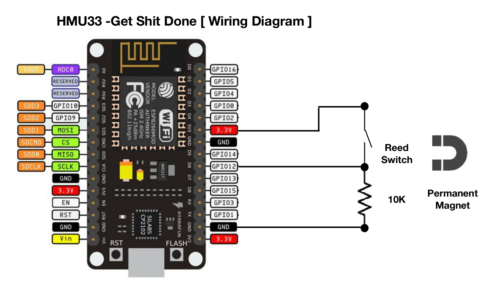

# Arduino door checker

> Author: Juan Antonio Celaya  

This is not part of the front-end app but the required code to make the Arduino device capable
to check the door state and to send it through WiFi.

